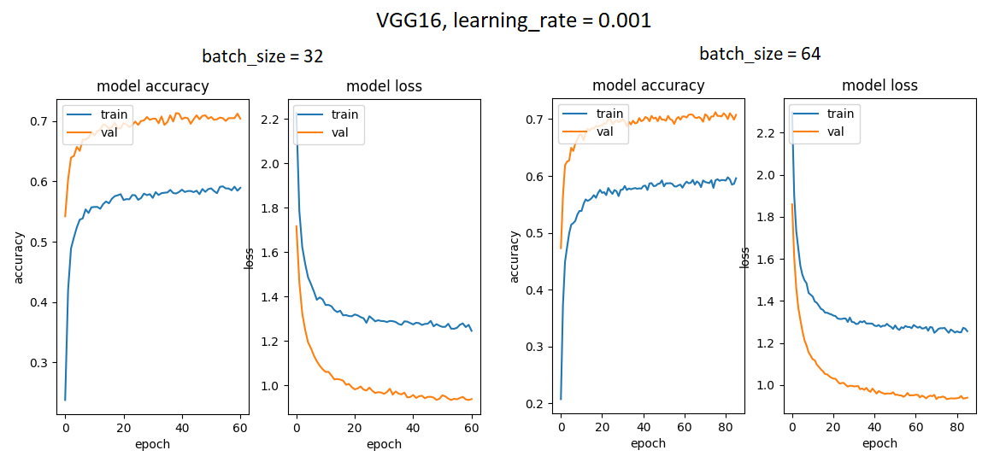
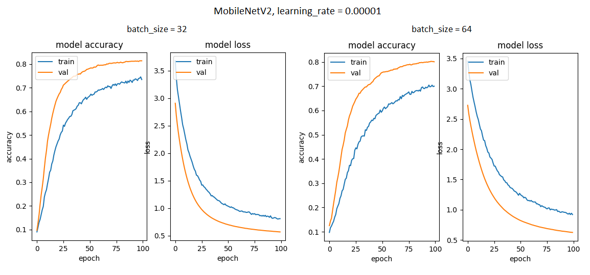

# Klasyfikacja rodzajów jedzenia na podstawie zdjęć - porównanie klasyfikatorów

## Problem

Celem projektu jest wytrenowanie i porównanie klasyfikatorów do celu niebinarnej klasyfikacji obrazów (multi-class).

## Baza danych

Baza danych **Food Images (Food-101)** pochodzi ze strony [kaggle.com/kmader/food41](https://www.kaggle.com/kmader/food41).
Udostępniona na stronie baza jest w formacie HDF5 i została podzielona na kilka odpowiadających sobie zestawów danych treningowych i testowych zawierających zdjęcia już wstępnie przetworzone. Na potrzeby tego projektu zdecydowano się nie korzystać z tego usprawnienia i przeprowadzić eksperymenty na oryginalnej (lecz okrojonej) bazie danych.

Oryginalna baza danych zawiera 101 000 zdjęć jedzenia przyporządkowanych do 101 kategorii (etykiet). Zbiór jest zbalansowany, czyli każda klasa zawiera tę samą ilość danych (1000 zdjęć).

Na potrzeby projektu bazę danych zmniejszono do 11 kategorii (dla 101 kategorii i pełnego zbioru danych jedna epoka treningu trwała minimum 0,5h). Oznacza to, że w bazie pozostało 11000 zdjęć.

## Eksploracja bazy danych

### Kategorie
Obrazy posiadają następujące kategorie:
```python
ceasar_salad
churros
cup_cakes
dumplings
frozen_yogurt
lasagna
macarons
onion_rings
oysters
pizza
waffles
```

### Rozmiar obrazów
Obrazy w bazie występują w 219 różnych rozmiarach. 20 najczęstszych oraz liczbę przynależnych im obrazów przedstawia wykres:


### Przykładowe obrazy

Przykładowe obrazy z bazy danych wraz z etykietami:


## Wstępne przetwarzanie

### Czyszczenie danych
Dokonano manualnego czyszczenia danych. Z bazy usunięto zdjęcia źle przyporządkowane do klas. Po czyszczeniu dystrybucja klas przedstawia się następująco:


Widać, że zbiór wciąż jest zbalansowany.

### Podział na zbiór treningowy, walidacyjny i testowy

Dane zostały podzielone na 3 podzbiory: treningowy (80%), walidacyjny (10%) i testowy (10%) za pomocą biblioteki `split-folders`:
```python
splitfolders.ratio(images_path,
                   output=SPLIT_LOC,
                   seed=1337,
                   ratio=(.8, .1, .1),
                   group_prefix=None)
```
Po podziale liczność zbiorów wygląda następująco:

| Zbiór            | Liczba obrazów| 
| ---------------- |:-------------:| 
| `training_set`   | `8595`        | 
| `validation_set` | `1070`        | 
| `test_set`       | `1084`        | 


### Augmentacja danych
Do augmentacji i dynamicznego generowania partii danych wykorzystano `DataImageGenerator` z biblioteki `tensorflow`:

```python
default_datagen = tf.keras.preprocessing.image.ImageDataGenerator(rescale=1./255)
train_datagen = tf.keras.preprocessing.image.ImageDataGenerator(rescale=1./255,
                                                                shear_range=0.2,
                                                                zoom_range=0.2,
                                                                rotation_range=20,
                                                                brightness_range=(0.5,1.2),
                                                                horizontal_flip=True)

train_batches = train_datagen.flow_from_directory(os.path.join(SPLIT_LOC, 'train'),
                                                  batch_size=b,
                                                  target_size=target_size) 

val_batches = default_datagen.flow_from_directory(os.path.join(SPLIT_LOC, 'val'),
                                                  batch_size=b,
                                                  target_size=target_size) 

test_batches = default_datagen.flow_from_directory(os.path.join(SPLIT_LOC, 'test'),
                                                   batch_size=b, 
                                                   target_size=target_size)
				
```
Rozmiar wszystkich obrazów został ujednolicony do `64x64x3`, przy czym wartości kanału (z zakresu `0-255`) zostały przeskalowane do wartości z zakresu `0-1`.

Dzięki zastosowanej augmentacji klasyfikator może uczyć się za każdym razem na lekko zmodyfikowanych danych. Dynamiczne generowanie partii danych sprawia, że cała baza danych nie musi być trzymana w pamięci.

Przykładowa partia obrazów generowana przez generator:


## Testowanie klasyfikatorów

W projekcie użyto biblioteki `tensorflow`.

### CNN

Pierwszym testowanym klasyfikatorem była konwolucyjna sieć neuronowa (CNN). Stworzono kilka podstawowych modeli i porównywano je dla różnych wartości zmiennych `batch_size, learning_rate`.

| Parametr         | Wartości                    | 
| ---------------- |:---------------------------:| 
| `batch_size`     | `32`, `64`                  | 
| `learning_rate`  | `0.001`, `0.0001`, `0.00001`|

Wszystkie modele były testowane z opcją `early_stopping = 7`, co oznacza, że jeśli po 7 epokach strata nie ulega poprawie, uczenie jest zatrzymywane.

#### 1. Sieć z 1 warstwą konwolucyjną

Pierwszym modelem jest bardzo podstawowa sieć z 1 warstwą konwolucyjną. Założenie było takie, że sieć ta występuje tylko dla porównania i nie spodziewano się po niej wysokich wyników.

```python
model = tf.keras.Sequential()
model.add(tf.keras.layers.Conv2D(32,
                                 kernel_size=(3, 3),
                                 activation='relu',
                                 input_shape=IMG_SHAPE))
model.add(tf.keras.layers.MaxPooling2D(pool_size=(2, 2)))
model.add(tf.keras.layers.Flatten())
model.add(tf.keras.layers.Dense(128,
                                activation='relu'))
model.add(tf.keras.layers.Dense(CLASS_NUM,
                                activation='softmax'))

model.compile(loss=tf.keras.losses.categorical_crossentropy,
             optimizer=tf.keras.optimizers.Adam(learning_rate=learning_rate),
             metrics=['accuracy'])
```
Maksymalna efektywność nie przekracza 50%. Widać, że szybko następuje overfitting.
W przypadku zmniejszenia `learning_rate` do `0.0001` lub `0.00001` model osiągnął nieco gorsze wyniki.


#### 2. Sieć z 3 warstwami konwolucyjnymi

```python
model = tf.keras.Sequential()
model.add(tf.keras.layers.Conv2D(32,
                                 kernel_size=(3, 3),
                                 activation='relu',
                                 input_shape=IMG_SHAPE))
model.add(tf.keras.layers.MaxPooling2D((2, 2)))
model.add(tf.keras.layers.Conv2D(64,
                                 kernel_size=(3, 3),
                                 activation='relu'))
model.add(tf.keras.layers.MaxPooling2D((2, 2)))
model.add(tf.keras.layers.Conv2D(128,
                                 kernel_size=(3, 3),
                                 activation='relu'))
model.add(tf.keras.layers.Flatten())
model.add(tf.keras.layers.Dense(128,
                                activation='relu'))
model.add(tf.keras.layers.Dense(CLASS_NUM,
                                activation='softmax'))
model.compile(loss='categorical_crossentropy',
              metrics=['accuracy'],
              optimizer=tf.keras.optimizers.Adam(learning_rate=learning_rate))
```
Ten model radzi sobie trochę lepiej, ale wciąż obserwujemy overfitting. Efektywność dochodzi do 61%, czyli 11 pp. więcej niż w przypadku sieci o 1 warstwie konwolucyjnej.


#### 3. Sieć z 4 warstwami konwolucyjnymi

W tej sieci wykorzystano dodatkowo wartstwy `BatchNormalization`, których zadaniem jest normalizacja wartości aktywacyjnych tak, aby ich
dystrybucja była taka sama podczas całego procesu uczenia. Mają one sprawić, że sieć będzie uczyła się szybciej.
```python
model = tf.keras.Sequential()
model.add(tf.keras.layers.Conv2D(32,
                                 kernel_size=(3, 3),
                                 activation='relu',
                                 input_shape=IMG_SHAPE))
model.add(tf.keras.layers.BatchNormalization())
model.add(tf.keras.layers.Conv2D(32,
                                 kernel_size=(3, 3),
                                 activation='relu'))
model.add(tf.keras.layers.BatchNormalization())
model.add(tf.keras.layers.MaxPooling2D(pool_size=(2, 2)))
model.add(tf.keras.layers.Conv2D(64,
                                 kernel_size=(3, 3),
                                 activation='relu'))
model.add(tf.keras.layers.BatchNormalization())
model.add(tf.keras.layers.Conv2D(128,
                                 kernel_size=(3, 3),
                                 activation='relu'))
model.add(tf.keras.layers.BatchNormalization())
model.add(tf.keras.layers.MaxPooling2D(pool_size=(2, 2)))
model.add(tf.keras.layers.Flatten())
model.add(tf.keras.layers.Dense(512,
                                activation='relu'))
model.add(tf.keras.layers.BatchNormalization())
model.add(tf.keras.layers.Dense(128,
                                activation='relu'))
model.add(tf.keras.layers.BatchNormalization())
model.add(tf.keras.layers.Dense(CLASS_NUM,
                                activation='softmax'))
model.compile(loss=tf.keras.losses.categorical_crossentropy,
             optimizer=tf.keras.optimizers.Adam(learning_rate=learning_rate),
             metrics=['accuracy'])
```

Ten model radzi sobie najlepiej, ale wyniki są wciąż niezadowalające. Dodatkowo obserwujemy zjawisko overfittingu.


#### Wpływ warstw typu Dropout na wyniki

Przeprowadzono testy na tych samych modelach z dodanymi warstwami typu `Dropout`, które poprzez losową dezaktywację niektórych neuronów zapobiegają nadmiernemu dopasowaniu do danych uczących.

Poniżej przedstawiono przykładowe wykresy dla sieci o 4 warstwach konwolucyjnych z dodanymi warstwami typu `Dropout`.

W przypadku tego modelu można zaobserwować, że czasami `train_accuracy` < `val_accuracy` lub `train_loss` > `val_loss`.
Może to wynikać z faktu, iż warstwy typu `Dropout` są aktywne podczas uczenia sieci, ale już nie podczas walidacji.
Widać jednak, że `Dropout` faktycznie zmniejszył ryzyko overfittingu.


#### Wyniki

W tabelach zebrano wyniki uzyskane na zbiorze testowym przez wszystkie modele sieci trenowane z różnymi parametrami.
Najlepsze wyniki dla każdego modelu zostały wyróżnione pogrubieniem.

##### CNN-1

|                  | `batch_size = 32`     |  `batch_size = 64` |
| ---------------- |:---------------------:|:------------------:| 
| `0.001`          |  48.89%               |    **49.91%**      | 
| `0.0001`         |  45.30%               |    42.71%          |
| `0.00001`        |  42.71%               |    39.58%          |


##### CNN-3

|                  | `batch_size = 32`     |  `batch_size = 64` |
| ---------------- |:---------------------:|:------------------:| 
| `0.001`          |  **61.53%**           |    **61.53%**      | 
| `0.0001`         |  53.23%               |    48.62%          |
| `0.00001`        |  45.94%               |    44.46%          |

##### CNN-4

|                  | `batch_size = 32`     |  `batch_size = 64` |
| ---------------- |:---------------------:|:------------------:| 
| `0.001`          |  55.16%               |    62.26%          | 
| `0.0001`         |  49.82%               |    **62.55%**      |
| `0.00001`        |  56.73%               |    51.94%          |


##### CNN-4 z warstwami typu Dropout

|                  | `batch_size = 32`     |  `batch_size = 64` |
| ---------------- |:---------------------:|:------------------:| 
| `0.001`          |   64.85%              |   **70.66%**       | 
| `0.0001`         |   60.70%              |   61.81%           |
| `0.00001`        |   56.92%              |   51.01%           |

Poniższy wykres przedstawia porównanie skuteczności na zbiorze testowym wszystkich wytrenowanych modeli:


Najlepsze wyniki uzyskała sieć o 4 warstwach konwolucyjnych z dodanymi warstwami `Dropout` dla `learning_rate = 0.001`, było to 70.66% na zbiorze testowym.
Mimo to, większość modeli nie była zbyt stabilna i szybko pojawiało się zjawisko over-fittingu.
Stabilność sieci poprawiła się nieco po zmniejszeniu `learning_rate` do `0.0001` albo `0.00001`, ale sieć osiągała wówczas mniejszą precyzję.
Można zaobserwować, że z reguły im większa sieć, tym lepsze wyniki uzyskiwała (więcej warstw oznacza lepszą zdolność uczenia). 
Najprawdopodobniej modele mogłyby uzyskać lepsze wyniki, gdyby ustawić parametr `patience` na większą wartość.

### Transfer learning

Sieci budowane "ręcznie" porównano z kilkoma gotowymi modelami.
Do każdego modelu dodano warstwy typu `GlobalAveragePooling2D`, `Dropout` i `Dense` oraz warstwę wyjściową.
Wykorzystano następujące modele:
1. Xception
2. VGG16
3. MobileNetV2

Na potrzeby transfer learning'u obrazy zostały przeskalowane do rozmiaru `128x128x3` ze względu na ograniczenia modeli.

#### 1. Xception

```python
base_model = tf.keras.applications.xception.Xception(weights='imagenet',
                                                input_shape=IMG_SHAPE,
                                                include_top=False)
base_model.trainable = False

inputs = tf.keras.Input(shape=(TARGET_SIZE[0], TARGET_SIZE[1], 3))
x = base_model(inputs, training=False)
x = tf.keras.layers.GlobalAveragePooling2D()(x)
x = tf.keras.layers.Dropout(0.5)(x)  # Regularize with dropout
outputs = tf.keras.layers.Dense(CLASS_NUM, activation='softmax')(x)
model = tf.keras.Model(inputs, outputs)

model.compile(optimizer=tf.keras.optimizers.Adam(learning_rate=learning_rate),
              loss='categorical_crossentropy',
              metrics=['accuracy'])
```


#### 2. VGG16
```python
base_model = tf.keras.applications.vgg16.VGG16(include_top=False,
                                               weights='imagenet',
                                               input_shape=IMG_SHAPE)
base_model.trainable = False
inputs = tf.keras.Input(shape=(TARGET_SIZE[0], TARGET_SIZE[1], 3))
x = base_model(inputs, training=False)
x = tf.keras.layers.GlobalAveragePooling2D()(x)
x = tf.keras.layers.Dropout(0.5)(x)  # Regularize with dropout
outputs = tf.keras.layers.Dense(CLASS_NUM, activation='softmax')(x)
model = tf.keras.Model(inputs, outputs)
model.compile(optimizer=tf.keras.optimizers.Adam(learning_rate=learning_rate),
              loss='categorical_crossentropy',
              metrics=['accuracy'])
```




#### 3. MobileNetV2
```python
base_model = tf.keras.applications.MobileNetV2(input_shape=IMG_SHAPE,
                                               include_top=False,
                                               weights='imagenet')
base_model.trainable = False
inputs = tf.keras.Input(shape=IMG_SHAPE)
x = base_model(inputs, training=False)
x = tf.keras.layers.GlobalAveragePooling2D()(x)
x = tf.keras.layers.Dropout(0.5)(x)
outputs = tf.keras.layers.Dense(CLASS_NUM, activation='softmax')(x)
model = tf.keras.Model(inputs, outputs)
model.compile(optimizer=tf.keras.optimizers.Adam(learning_rate=learning_rate),
              loss='categorical_crossentropy',
              metrics=['accuracy'])
```




#### Wyniki

W tabeli przedstawiono wyniki uzyskane na zbiorze testowym przez wszystkie modele sieci trenowane z różnymi parametrami.

##### Xception

|                  | `batch_size = 32`     |  `batch_size = 64` |
| ---------------- |:---------------------:|:------------------:| 
| `0.001`          |   84.32%              |  85.42%            | 
| `0.0001`         |   **85.52%**          |  71.40%            |
| `0.00001`        |   82.66%              |  81.18%            |

##### VGG16

|                  | `batch_size = 32`     |  `batch_size = 64` |
| ---------------- |:---------------------:|:------------------:| 
| `0.001`          |   **71.31%**          |  70.94%            | 
| `0.0001`         |   69.19%              |  58.76%            |
| `0.00001`        |   52.40%              |  50.18%            |

##### MobileNetV2

|                  | `batch_size = 32`     |  `batch_size = 64` |
| ---------------- |:---------------------:|:------------------:| 
| `0.001`          |    85.06%             |  **85.70%**        | 
| `0.0001`         |    84.87%             |  70.94%            |
| `0.00001`        |    82.84%             |  80.81%            |

Poniższy wykres przedstawia porównanie skuteczności na zbiorze testowym wszystkich wytrenowanych modeli:


Można zauważyć, że modele te radzą sobie znacznie lepiej niż proste sieci CNN.
Najlepszym modelem dla badanego problemu okazał się MobileNetV2 (wyniki od 71% do 86%).
Podobnie z problemem poradził sobie Xception (72%-86%). Najgorzej wypadł VGG16 (50%-71%).

Macierz błędu dla najefektywniejszego modelu (MobileNetV2, `learning_rate = 0.001`, `batch_size = 64`) przedstawia się następująco:


Widać, że model mylił się w uzasadnionych przypadkach - najczęściej mylił `lasagne` z `pizza`, oraz `onion rings` i `churros`.
Klasą, przy której model mylił się najrzadziej, to `caesar_salad`, natomiast najczęściej - `waffles`.

Przykładowe źle zaklasyfikowane obrazy wraz z poprawnymi etykietami:


### Wnioski

Można zauważyć, że gotowe modele, mimo że nie osiągały efektywności powyżej 90% (niewykluczone, że mają taki potencjał po bardziej dokładnym dopasowaniu do problemu),
zachowywały się znacznie stabilniej, niż proste sieci CNN. Wynika to prawdopodobnie z bardziej zaawansowanej konstrukcji tych modeli.
Proste modele sieci konwolucyjnych gorzej się uczyły i częściej dotyczył ich problem overfittingu. Jedynie sieć o 4 warstwach konwolucyjnych z dodanymi
warstwami typu `Dropout` uzyskała wyniki zbliżone do pre-trenowanego modelu, który wypadł najgorzej (VGG16).
